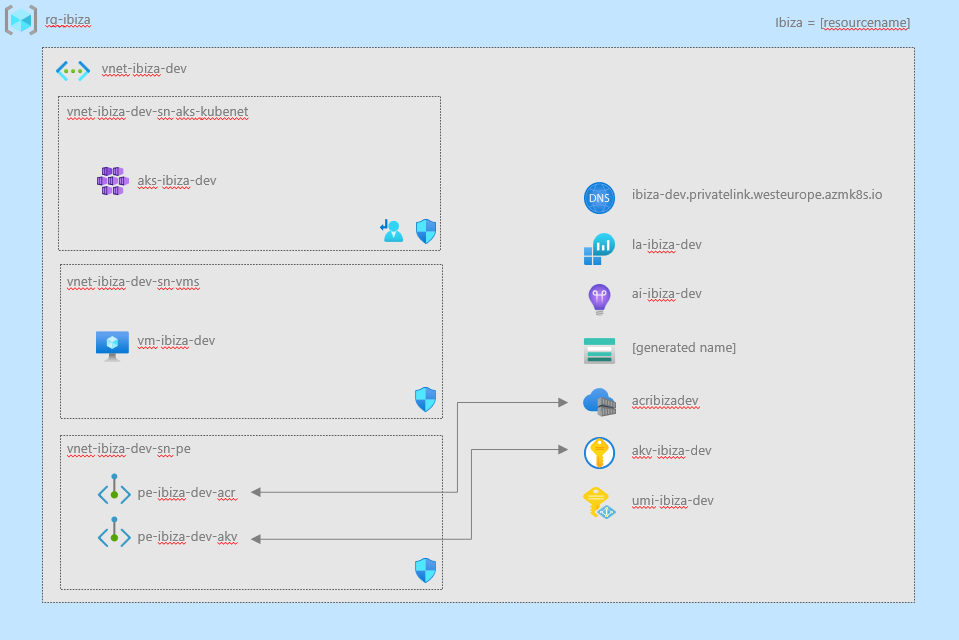

# AKS hackathon - private cluster

This repo contains a step-by-step giude to setup a private AKS cluster. 

# Overview




## Prerequisites 

- Github account
- VS code with GitHub Codespaces extension
- Azure subscription with RBAC role Owner

## Getting started

### Fork and clone the repository

Log in to GitHub with your GitHub account. Fork this repo by selecting the Fork menu in the GitHub top right corner.


> **Note**<br>
> If your GitHub account is part of an organization there is a limitation that only one fork is possible in the same organization. The workaround is to clone this repo, create a new repository and then push the code from the cloned working copy similar to this:
>
>  ``` shell
>  git clone https://github.com/jonasnorlund/aks-hack
>  cd aks-hack
>  git remote set-url origin <url of your new repo>
>  git push origin master
>  ```
>

Clone the fork using git. 
```shell
git clone <your GitHub repository url>/aks-hack
cd aks-hack/private-cluster 
```

### Open the repo in Codespaces

Click on the "Remote Explorer" extension in VS Code and choose "GitHub Codespaces" in the dropdown at the top. Then click "Create Codespace". Choose your cloned repo and the main branch, set the size to "4 cores, 8 GB RAM, 32 GB storage". VS Code restarts and now run in GitHub Codespaces. 


## Step-by-step guidance

Below is the step-by-step guidance. 

## Step 1 - Log in to Azure
```shell
az login
az account set -s [your subscription]
```
Need to register the following features. This is a two step process, run the following two commands we will return to this later because it can take up to 10 minutes to be finished.
```shell
az feature register --namespace microsoft.compute --name EncryptionAtHost
az feature register --namespace "Microsoft.ContainerService" --name "EnableWorkloadIdentityPreview"
```
## Step 2 - Create resourcegroup and choose resourcename

Choose a resourcename of six letters e.g "majnor" that will be used to create a unique environment. That will also be a part of the naming convention to be used. 
Create resourcegroup
```shell 
az group create -l westeurope -n [rg-resourcename]
```
Verify that it has been created in the portal. 

## Step 3 - Get familiar with Bicep

Open aks-hack/private-cluster/bicep folder in VS Code. 

Make sure the following parameters are set in the main.bicep file. 

```shell
param deployInit bool = true
param deployAzServices bool = false
param deployAks bool = false
param deployVm bool = false
```
Run the following command. 
```shell
az deployment group create -g [rg-resourcename] -n mainDeploy -f main.bicep -p resourcename=[resourcename]
```
Verify the deployment in the portal.

## Step 4 - Deploy supporting Azure services

Change the following parameter to "true" in main.bicep
```shell
param deployAzServices bool = true
```
Run the following command. 
```shell
az deployment group create -g [rg-resourcename] -n mainDeploy -f main.bicep -p resourcename=[resourcename]
```
Verify the deployment in the portal.

## Step 5 - Deploy AKS

Run the following Azure CLI commands. This is the second step in registering new features that we did in step 1.  
```shell
az provider register --namespace microsoft.compute
az provider register --namespace Microsoft.ContainerService
```
Change the following parameter to "true" in main.bicep
```shell
param deployAzServices bool = true
```
Add the following parameter in the Azure CLI command. 
```shell
admingroupobjectid=[objectId of AAD group]
```
This should be a valid objectId of a group in AAD that will have cluster role admin in AKS. 


Run the following command. 
```shell
az deployment group create -g [rg-resourcename] -n mainDeploy -f main.bicep -p resourcename=[resourcename] admingroupobjectid=[objectId of AAD group]
```
Verify the deployment in the portal.

## Step 6 - Upload file to storage and deploy deploy VM

Upload the file "setup.ps1" to your storageaccount. Run the following command. 
```shell
az storage blob upload -f setup.ps1 --account-name [your storageaccount name] -c vmconfig -n setup.ps1
```
Change the following parameter to "true" in main.bicep
```shell
param deployVm bool = true
```
Identify your IP address and add the following parameters to your Azure CLI command. 
```shell
az deployment group create -g [rg-resourcename] -n mainDeploy -f main.bicep -p resourcename=[resourcename] admingroupobjectid=[objectId of AAD group] allowedhostIp=[your IP address] vmpwd=[Set a pwd of 8 chars vm]
```

## Step 7 - Get access to AKS

Login to the VM in Azure, open a terminal and run the following commands. 
```shell
az login -t [your tenantId]
az aks get-credentials --resource-group [rg-resourcename] --name aks-[resourcename]-dev
```
Validate access
```shell
kubectl get pods
```
Use the browser to valdate the login. You should see "No resources found in default namespace."

if you want to create a shortcut for Kubectl run the following commands in the terminal. 
```shell
New-Item -Path $profile -Type File -Force 
notepad $profile
Set-Alias -Name k -Value kubectl
```
Save the file restart the terminal. 
Validate by running "k get pods" in a terminal. 

Done.


## Step 8 - Deploy private endpoints

Change the following parameters in main.bicep
```shell
param deployInit bool = true
param deployAzServices bool = true
param deployAks bool = false
param deployVm bool = false
param deployPe bool = true

```
This will disable AKS and VM deployment (to save time) and enable deployment of private endpoints for AKV and ACR. Run the following command. 
```shell
az deployment group create -g [rg-resourcename] -n mainDeploy -f main.bicep -p resourcename=[resourcename]
```
Verify the deployment in the portal.

## Step 9 - Deploy AKS workload

Login to the VM. 
Open a terminal and install Git. Run "choco install git"
Create a folder under c:\ called "temp"
```shell
cd\
mkdir temp
cd .\temp
```
Clone your repo. 
```shell
git clone git clone https://github.com/[your github account]/aks-hack.git
```
Goto the Azure portal and copy the instrumentation key for Application Insights. 
Open the file aks-hack/private-cluster/sample/distributed-calculator/deploy/open-telemetry-collector-appinsights.yaml
Paste your instrumentation key inside the quotes "<INSTRUMENTATION-KEY>"
In the terminal navigate to aks-hack/private-cluster/sample/distributed-calculator/deploy
Run the following commands. 

```shell
kubectl create ns sample 
helm repo add bitnami https://charts.bitnami.com/bitnami
helm repo update
helm install redis bitnami/redis --namespace sample
kubectl apply -f . -n sample
```

Run "kubectl get svc -n sample" to get the external IP and use a browser to access the frontend of the calculator.  


